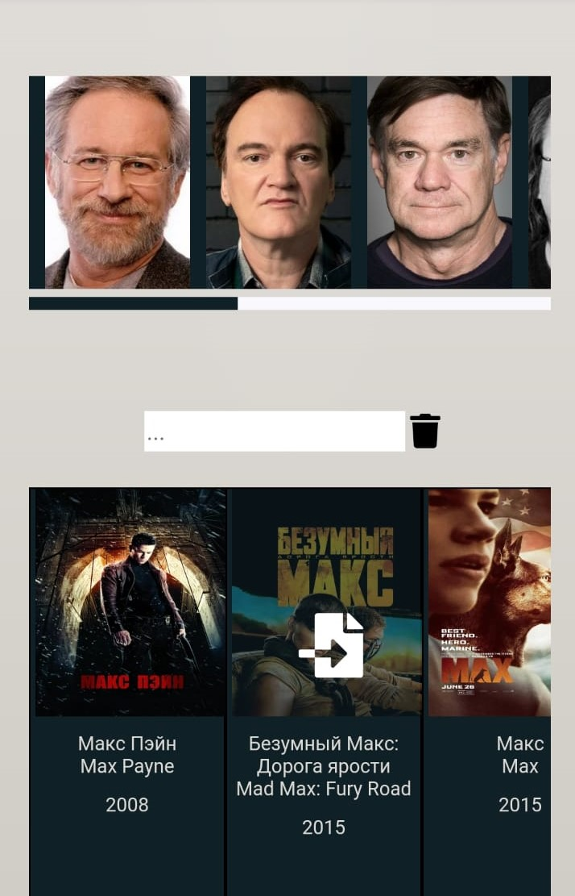
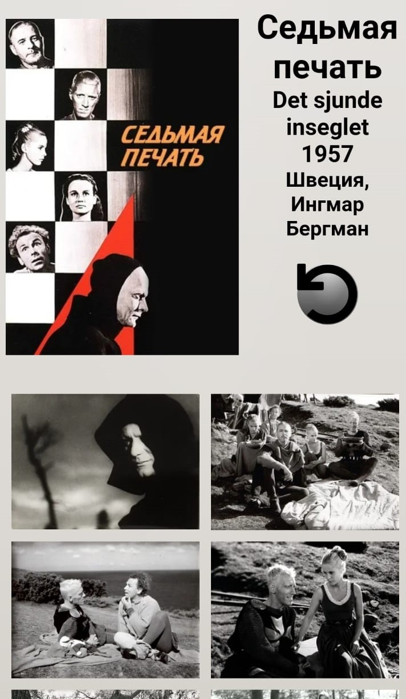
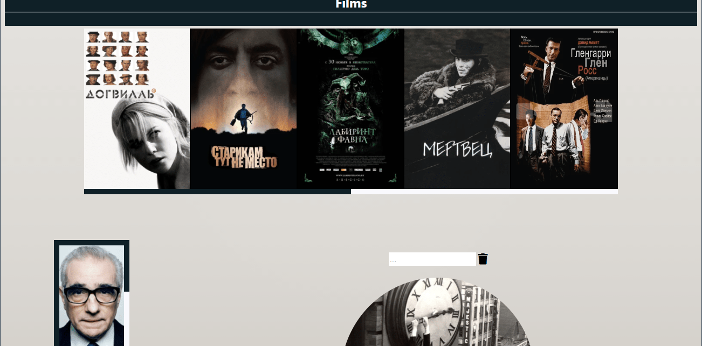
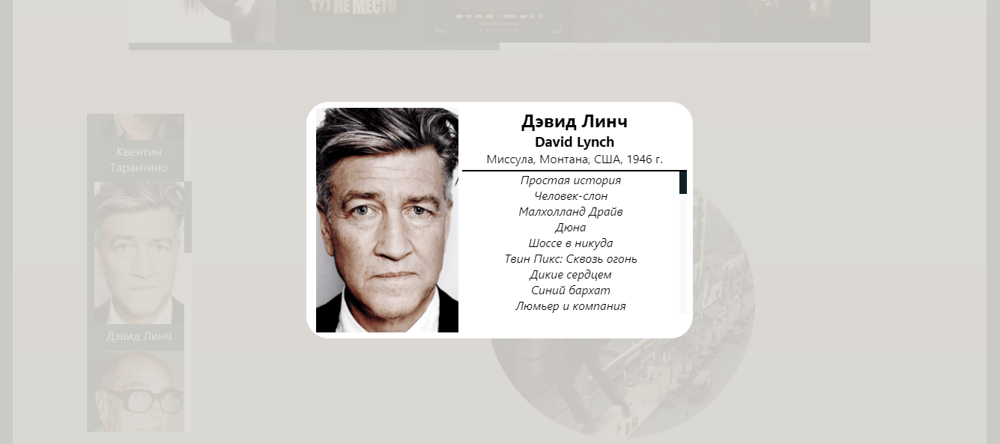

получаем данные с kinopoiskapiunofficial.tech, и отображаем двумя слайдерами ( фильмы, режиссеры) и компонентом с полем ввода для поиска фильма по ключевым словам,
для каждого фильма генерируется страница.

Используется observer, debounce и горизонтальный скролл. 
react-transition-group и react-hook-form испоьзуются исключительно ради практики, 

[сайт](https://duremarduremar.github.io/my-typescript/)  

